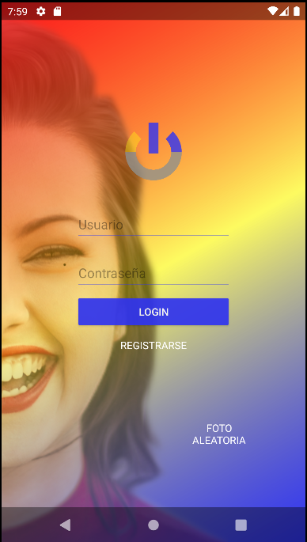

# Login sencillo

* Mi login sencillo se basa en en 4 pantallas: La ventana de splash (ventana de carga), el propio login, una ventana
de registro y una ventana que visualiza de una web fotos de personas que no existen.

## Ventana Splash

* La ventana de splash no es mas que una animacion de un fondo rotando y de el logo parpadeando dando la sensacion
al usuario de que se esta abriendo la aplicacion y de que esta cargando.

## Ventana Login

* El login tiene la clasica estructura de inicio de sesion , con sus campos de usuario y contraseña junto con el 
boton de logearse y el de , en el caso de que no este registrado, el de registro.
Aparte de esa estructura clasica, tambien incluyo un boton hacia otra ventana llamado "Foto Aleatoria" la cual 
explicare mas adelante

## Ventana Registro

* La ventana de registrarse es tambien la clasica ventana de registro, con sus campos de nombre , contraseña y
correo electronico, junto con un boton para realizar el registro 

## Ventana Foto Aleatoria

* En esta ventana tenemos dos funcionalidades: La primera de ellas es la de mostrar en pantalla una web que genera fotos de gente aleatoria, la funcionalidad
que he integrado ha sido que al hacer un SwipeRefresh (refrescar la pagina arrastrando hacia abajo) se muestre
otra foto aleatoria.
Tambien esta ventana dispone de un menu contextual que al mantener pulsado un texto, se despliega el menu 
con sus distintas opciones

Tambien tenemos otro tipo de menu situado en la actionbar, en la cual tenemos el clasico boton de opciones junto 
con un boton de lupa (Busqueda) y otro de una camara.

### El boton de camara

* EL boton de camara merece una mencion especial debido a que he añadidio una funcionalidad extra, la cual es 
que al pulsar ese boton, se abre la aplicacion nativa de la camara de fotos de tu dispositivo movil y te permitira
hacer una foto y seleccionarla.

Para realizarlo , tenemos que darle, a nuestra aplicacion , permiso del dispositivo para abrir la camara.
Esto se realiza añadiendo en el archivo Manifest la siguiente linea:

~~~
<uses-feature android:name="android.hardware.camera" android:required="true" />
~~~

Con esto ya tendriamos los permisos sin necesidad de preguntarle al usuario. Esto lo hago por comodidad pero
lo correcto seria que la aplicacion preguntara al usuario si le da permiso a nuestra aplicacion para abrir 
la camara.

Despues de darle permisisos, viene la parte del codigo, la cual se realizara atraves de la clase Intent y se
realiza insertando en el evento de nuestro boton , el siguiente codigo

~~~
Intent capturaFoto = new Intent(MediaStore.ACTION_IMAGE_CAPTURE);
startActivity(capturaFoto);
~~~

  

